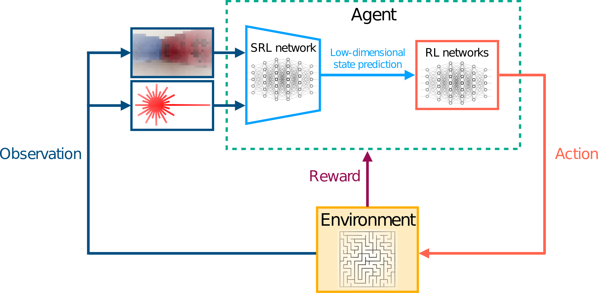

# SRL-with-robotics-priors
## Table of contents
* [General info](#general-info)
* [Framework](#framework)
* [Requirements](#requirements)
* [Setup](#setup)

## General info
This repository includes the source code associated with the publication titled "Low Dimensional State Representation Learning with Robotics Priors in Continuous Action Spaces", published in IROS2021. The full paper's text can be found through this [Link](https://ieeexplore.ieee.org/abstract/document/9635936).

This repository includes two different algorithms, one for state representation learing from high dimensional observations that the robot acquires from its sensors, and the other is to learn a navigation policy, using a deep reinforcement learning approach, from the learnt low dimensional state. The process for running this project is divided into three stages:
* The first stage is to run a random policy to collect samples from the virtual environment which are needed to learn a state representation.
* The second stage is to run the SRL algorithm to learn a latent state representation from the collected observations.
* The third stage is to load the learnt SRL model and use it together with the RL algorithm to learn a navigation policy.

Here it should be pointed out that a navigation problem is used as a case study for this paper, however the reader can feel free to use the proposed SRL algorithm for his/her own problem. For this, please generate your own samples to train the SRL network.

## Framework


## Requirements
The following setup is required to run the repository:
* Ubuntu 16.04
* ros kinetic
* tensorflow 1.14.0

Please note that, it is recommended to create a virtual environment where you can install the required python packages and use it for this project.
	
## Setup
To run this project, please follow this set of instructions:
* create a ros workspace
```
$ mkdir -p ~/<your ros workspace>/src
$ cd ~/<your ros workspace>/
$ catkin build
```
* clone the project into the src directory, and build it. Please note that all the required packages to run the project are included in the repository and no additional external packages are required.
```
$ git clone https://github.com/KHALEDALAAELDIN/Low-Dimensional-State-Representation-Learning-with-Robotics-Priors.git
$ catkin build
$ source devel/setup.bash
```
* To generate random samples from the simulated environment to use it later for the training of the SRL network, please launch the simulated environment first:
```
$ roslaunch turtlebot3_gazebo turtlebot3_4walls_large.launch 
```
* Now you should be able to see the turtlebot standing in a gazebo environment. To run a random policy in this environment, please launch the following file:
```
$ roslaunch rosbot_srl start_ddpg_4walls_large.launch 
```
* It will ask you if you want to load the learned parameters of the SRL network, or to load the learned parameters of the RL algorithm. At this stage, please answer NO to both questions, since we don't have learned networks yet, by writing `n` and then pressing `enter`. The robot will then start collecting data (state, action, reward) by following a random policy and save this information to a pickle file. The pickle file is updated with new samples every 10 episodes. You can either wait until all episodes are over, or terminate the process manually from the terminal.
* Please navigate to the SRL file directory and run the python script to start the SRL process:
```
$ cd <your ros workspace>/src/rosbot_srl/scripts
$ python StateRepresentation_Continuous_V2.py
```
After the SRL model is trained, you can check the results which are written to a pdf file in this directory `<your ros workspace>/src/rosbot_srl/training_results`. The learnt parameters of the neural network are written to a `checkpoint` file that you can find in this directory `<your ros workspace>/src/rosbot_srl/training_results/srl`.
**Please note that the files directories are all handled by the scripts, so you don't need to worry about it**.
* After learning a latent state representation, we can run the RL algorithm to learn a navigation policy. This is done by launching the following files in two different terminals
```
$ roslaunch turtlebot3_gazebo turtlebot3_4walls_large.launch
$ roslaunch rosbot_srl start_ddpg_4walls_large.launch
```
In the second terminal, you will be asked again if you want to load the learnt paramters of the RL network. The answer will be NO again since we haven't run it yet. Then, you will be asked if you want to load the learnt parameters of the SRL network, the answer should be YES by writing `y`, and then pressing `enter`. At this stage, the RL algorithm will start learning and the learning process will be over after a certain number of episodes that you can define in the `yaml` file that you can find in this directory `<your ros workspace>/src/rosbot_srl/config`.

Once the robot learns a navigation policy, you can load the parameters of both the RL and SRL networks to test the learnt policy. This is done by running both launch files again as mentioned previously, but this time please answer YES to both questions.
